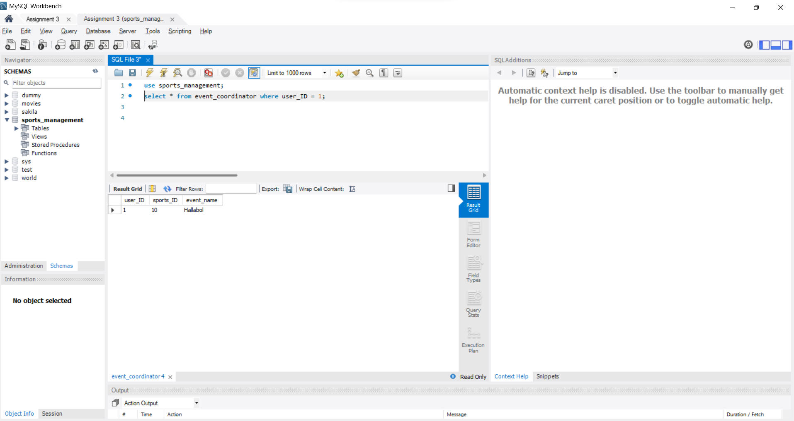
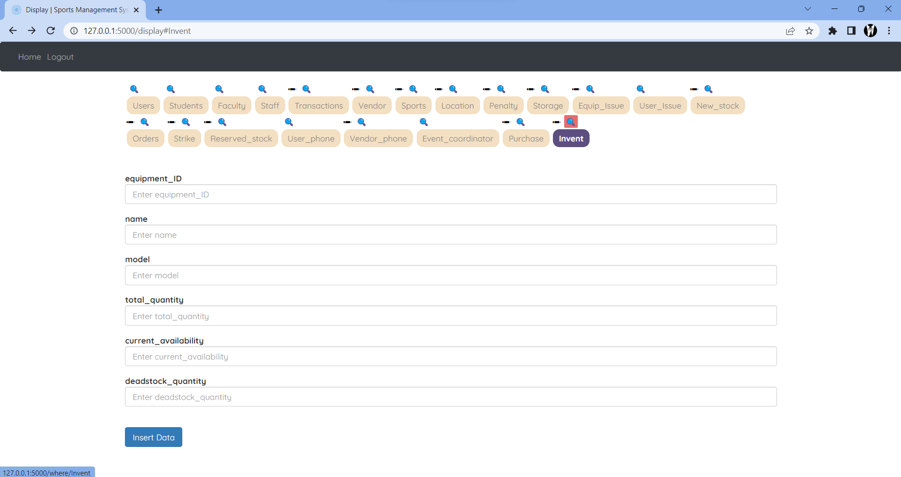

# CS 432 Assignment BTech19
This repository contains the source code for all Assignment 3 of the Databases (CS 432) course by Prof. Mayank Singh.
The goal is to develop a DBMS using Flask and MySQl

## Getting Started

To set up the environment to run the assignment codes follow the below steps:

- You must have [Python](https://www.python.org/) and pip installed on your laptop/desktop. Run the following commands to check the whether you have them installed or not.
```
python --version
pip --version
```

- You must also have [git](https://git-scm.com/) installed on your laptop/desktop. Run the following command to check the same.
```
git --version
``` 

- Clone this git repository. Run git branch to ensure you are on the main branch. 
```
git clone https://github.com/Reuben27/CS432.git
cd CS432
git branch
```

- Install the packages from requirements.txt
```
pip install -r requirements.txt
```

- You must also have MySQL Workbench installed on your laptop/desktop. Run the following command in MySQL Command Client to create the database being used in the website. Here the path, is the path to the setup.sql file. 
```
source <path>
```

- For example in my laptop I ran,
```
source E:\IITGn-Academics\Semester-VIII\CS432\setup.sql
```

## Runnig the Web App

In order to run the Web App you can run the following command in your terminal or run main.py file

- Run main.py file 
```
python main.py
```
<br>


<br>

- Open the link for the Web Server present in your terminal or you can copy the following link:
```
http://127.0.0.1:5000/
```

- The link will direct you to Home page of our WebApp. Click the login button will direct you to our login page.

### User Login 
<br>


- You can login as existing user if you already have an account or you can Sign Up by selecting the Sign up button in the navigation bar. (By signing up your details are going to get stored in the users table of our database)
<br>


<br>
<br>

### Admin Login

- You can also Login as Admin. In the navigation bar select Admin Login. In the login form enter the following credentials for login.

```
Email: admin_dbms@iitgn.ac.in
Password: 12345678
```

- Once you have logged in successfully. The Display page will appear in which you can view , delete and update the data of all the tables.


- You can also rename tables using the pencil icon and also search data in a particular table using the where clause.

Below are the screenshots of successfully executed queries in the database:

## Insert
<br>
As you can see from the picture that we are able to insert data in the table using our Web App.
<br>



<br>
<br>

## Update 
<br>
The figure shows successful running of the update query. We are able to update data present in the table.
<br>


<br>
<br>

## Delete
<br>
We have implemented a delete button in front of every row of table. It allows us to delete a particular row of the selected table. 
<br>


<br>
<br>

## Rename
<br>
By clicking on the Pencil icon, you are redirected to another page in which you can change the name of table present.
<br>


<br>
<br>

## Where
<br>
By clicking on the Magnifying Glass button on top of the table name, you are redirected to a different page in which you can provide the field name and value for implementing the where query.
<br>




